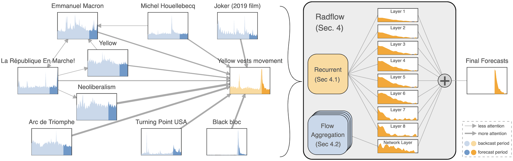

# Radflow: A Recurrent, Aggregated, and Decomposable Model for Networks of Time Series



This repository contains the code to reproduce the results in our TheWebConf
2021 paper [Radflow: A Recurrent, Aggregated, and Decomposable Model for
Networks of Time Series](https://arxiv.org/abs/2102.07289). We propose a new
model for networks of time series that influence each other. Graph structures
among time series are found in diverse domains, such as web traffic influenced
by hyperlinks, product sales influenced by recommendation, or urban transport
volume influenced by road networks and weather. There has been recent progress
in graph modeling and in time series forecasting, respectively, but an
expressive and scalable approach for a network of series does not yet exist.

We introduce Radflow, a novel model that embodies three key ideas: a recurrent
neural network to obtain node embeddings that depend on time, the aggregation
of the flow of influence from neighboring nodes with multi-head attention, and
the multi-layer decomposition of time series. Radflow naturally takes into
account dynamic networks where nodes and edges change over time, and it can be
used for prediction and data imputation tasks. On real-world datasets ranging
from a few hundred to a few hundred thousand nodes, we observe that Radflow
variants are the best performing model across a wide range of settings. The
recurrent component in Radflow also outperforms N-BEATS, the state-of-the-art
time series model. We show that Radflow can learn different trends and seasonal
patterns, that it is robust to missing nodes and edges, and that correlated
temporal patterns among network neighbors reflect influence strength.

We curate WikiTraffic, the largest dynamic network of time series with 366K
nodes and 22M time-dependent links spanning five years. This dataset provides
an open benchmark for developing models in this area, with applications that
include optimizing resources for the web. More broadly, Radflow has the
potential to improve forecasts in correlated time series networks such as the
stock market, and impute missing measurements in geographically dispersed
networks of natural phenomena.

Please cite with the following BibTeX:

```raw
@InProceedings{Tran2021Radflow,
  author = {Tran, Alasdair and Mathews, Alexander and Ong, Cheng Soon and Xie, Lexing},
  title = {Radflow: A Recurrent, Aggregated, and Decomposable Model for Networks of Time Series},
  year = {2021},
  publisher = {Association for Computing Machinery},
  url = {https://doi.org/10.1145/3442381.3449945},
  booktitle = {Proceedings of The Web Conference 2021}
}
```

## Getting Started

```sh
conda env create -f conda.yaml
conda activate radflow
python -m ipykernel install --user --name radflow --display-name "radflow"
python setup.py develop

# Install apex
git submodule init lib/apex && git submodule update --init lib/apex
cd lib/apex
pip install -v --no-cache-dir --global-option="--pyprof" --global-option="--cpp_ext" --global-option="--cuda_ext" ./
cd ../..

# Install PyTorch Geometric
pip install -U torch-scatter==latest+cu102 -f https://pytorch-geometric.com/whl/torch-1.6.0.html
pip install -U torch-sparse==latest+cu102 -f https://pytorch-geometric.com/whl/torch-1.6.0.html
pip install -U torch-cluster==latest+cu102 -f https://pytorch-geometric.com/whl/torch-1.6.0.html
pip install -U torch-spline-conv==latest+cu102 -f https://pytorch-geometric.com/whl/torch-1.6.0.html
pip install -U torch-geometric
```

## Preparing the Datasets

```sh
# Start an empty mongodb database
mongod --bind_ip_all --dbpath data/mongodb --wiredTigerCacheSizeGB 10

# Process vevo data
python scripts/prepare_vevo_network.py

# Download wiki dump. This takes about three days.
python scripts/download_wikidump.py

# With wiki dump, we get 668 files. Each file has on average 290M lines.
# If we use a single thread (no parallelization), it takes between 3-7 hours
# to go through each file. The following scripts construct a mongo database
# for the entire wiki graph. This takes about 40 hours.
python scripts/extract_graph.py --dump /data4/u4921817/radflow/data/wikidump --host dijkstra --n-jobs 24 --total 232 --split 0 # braun
python scripts/extract_graph.py --dump /data4/u4921817/radflow/data/wikidump --host dijkstra --n-jobs 20 --total 232 --split 1 # cray
python scripts/extract_graph.py --dump /data4/u4921817/radflow/data/wikidump --host dijkstra --n-jobs 20 --total 232 --split 2 # cray

# Remove duplicate titles. Generate a cache title2pageid.pkl that maps
# the title to the original page id. We also reindex the page IDs, taking 3h.
# We end up with 17,380,550 unqiue IDs/titles.
python scripts/extract_graph.py --reindex

# Get page view counts directly from wiki API. Takes around 3 days.
python scripts/get_traffic.py -m localhost -b 0 -t 3 # dijkstra
python scripts/get_traffic.py -m dijkstra -b 1 -t 3 # cray
python scripts/get_traffic.py -m dijkstra -b 2 -t 3 # braun

# Store wiki graph in hdf5
python scripts/extract_wiki_subgraph.py

docker build -t alasdairtran/radflow .
docker push alasdairtran/radflow

# On the server with GPU
docker build -t alasdairtran/radflow .
docker run -p 44192:44192 --ipc=host -v $HOME/projects/phd/radflow:/radflow alasdairtran/radflow

# On the client, find internal IP address
hostname -I

# Back up databases
mongodump --db wiki2 --host=localhost --port=27017 --gzip --archive=data/mongobackups/wiki-2020-09-17.gz
mongodump --db vevo --host=localhost --port=27017 --gzip --archive=data/mongobackups/vevo-2020-09-17.gz
```

## Training

```sh
# Some experiments don't utilize the whole GPU, so we can run many parallel
# experiments on the same GPU.
# When using MPS it is recommended to use EXCLUSIVE_PROCESS mode to ensure that
# only a single MPS server is using the GPU, which provides additional insurance that the
# MPS server is the single point of arbitration between all CUDA processes for that GPU.
# Setting this does not persist across reboot
sudo nvidia-smi -i 0,1 -c EXCLUSIVE_PROCESS
CUDA_VISIBLE_DEVICES=0,1 \
    CUDA_MPS_PIPE_DIRECTORY=/tmp/nvidia-mps \
    CUDA_MPS_LOG_DIRECTORY=/tmp/nvidia-log \
    nvidia-cuda-mps-control -f

export CUDA_MPS_PIPE_DIRECTORY=/tmp/nvidia-mps
export CUDA_MPS_LOG_DIRECTORY=/tmp/nvidia-log

# Naive baselines (no training is needed)
CUDA_VISIBLE_DEVICES= radflow evaluate expt/pure_time_series/vevo/01_copying_previous_day/config.yaml
CUDA_VISIBLE_DEVICES= radflow evaluate expt/pure_time_series/vevo/02_copying_previous_week/config.yaml

# Example training and evaluation
CUDA_VISIBLE_DEVICES=1 radflow train expt/network_aggregation/vevo_dynamic/imputation/one_hop/15_radflow/config.yaml -f
CUDA_VISIBLE_DEVICES=1 radflow evaluate expt/network_aggregation/vevo_dynamic/imputation/one_hop/15_radflow/config.yaml -m expt/network_aggregation/vevo_dynamic/imputation/one_hop/15_radflow/serialization/best.th
```
